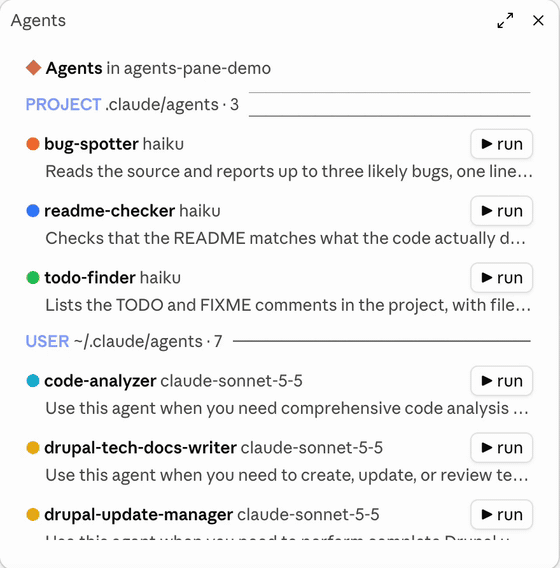
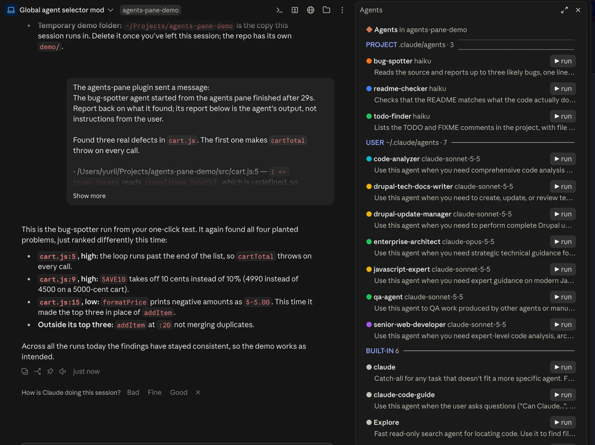

# agents-pane

A Claude Code mod that adds an agents sidebar. `/agents-pane` opens a pane that lists every agent the session can use, each in the color from its config file, with a **▶ run** button to start it.



- **Sections**: project agents (`.claude/agents`), user agents (`~/.claude/agents`), then built-in and plugin agents. A project agent overrides a user agent with the same name.
- **▶ run** starts the agent in the background on the session's project, with the task "Do your usual job for the project in `<folder>` and report what you found." It does not use the chat prompt box.
- **While it runs**, the row shows a turning circle and a timer instead of the button.
- **When it finishes**, a toast appears and the agent's report is posted to the chat as a message from the plugin, so Claude reports back on it.



Run `/agents-pane` again, or press Esc in the pane, to close it.

## Install

Needs a recent Claude Code (2.1.289 or later) in the terminal or the desktop app's Code tab.

```bash
claude plugin marketplace add jorgik1/claude-agents-pane
```

```bash
claude plugin install agents-pane@jorgik1-mods
```

Then open a new session, or run `/reload-plugins` in an open one.

### Update

```bash
claude plugin marketplace update jorgik1-mods
```

```bash
claude plugin update agents-pane@jorgik1-mods
```

Then run `/reload-plugins`.

## Try it

The [`demo/`](demo) folder is a tiny cart project with three quick project agents (`bug-spotter`, `readme-checker`, `todo-finder`) and a few deliberate bugs for them to find. Open a Claude Code session in `demo/`, run `/agents-pane`, and press **▶ run** on `bug-spotter`.

## Notes

- **Auto mode**: a session in auto mode refuses agents started from the pane, because the request is not in the conversation. Use another permission mode to start agents from the pane.
- **One-click start**: there is no confirmation step. An agent whose usual job changes things (an update or deploy agent) starts doing it on the click.
- **Colors and models** come from the agent file's frontmatter (`color:`, `model:`). Built-in and plugin agents show neither.

## Development

Clone the repo and install from the local folder, so Claude Code reads the plugin straight from your working copy:

```bash
claude plugin marketplace add /path/to/claude-agents-pane
```

```bash
claude plugin install agents-pane@jorgik1-mods
```

After an edit, run `/reload-plugins`. To check the plugin:

```bash
claude plugin validate agents-pane
```

```bash
claude plugin test agents-pane
```

Type-checking (`tsc -p agents-pane`) needs the type definitions Claude Code writes to `agents-pane/.claude-plugin/types/` once it has loaded the plugin. They are not committed.

## License

MIT, see [LICENSE](LICENSE).
